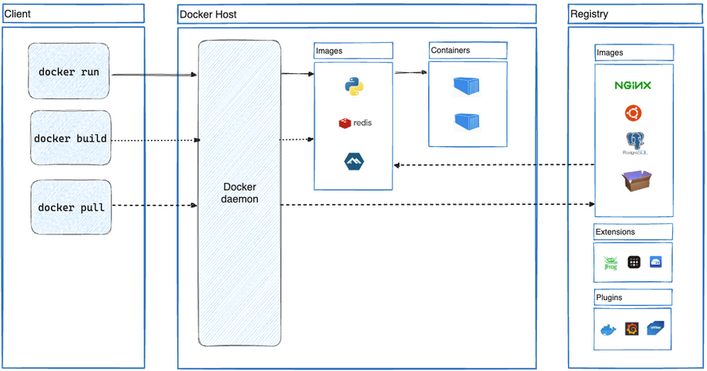
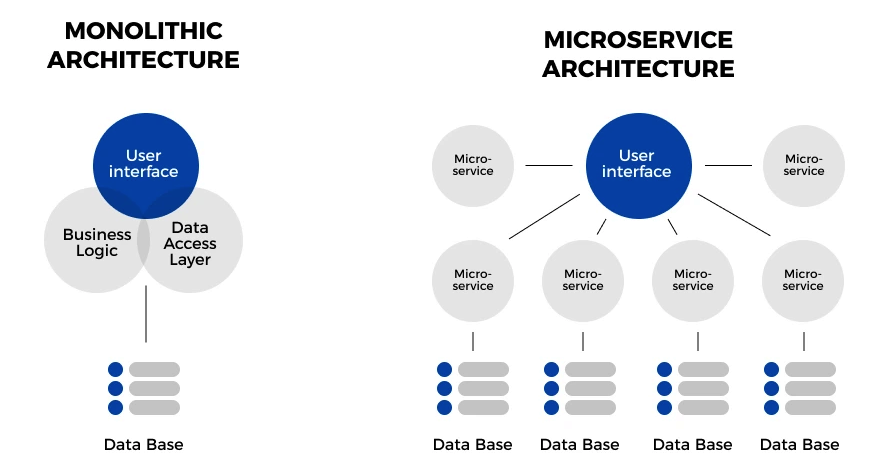
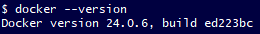

# What is Docker

Docker is a service that provides users with pre-provisioned images containing the OS, software, set-up and dependencies for use in testing applications. This is called **software as a service**. 

These images are called **containers**, and will have everything required to run what is being tested. So for example, if you were tesing a web application, you can download and run an image containing nginx in a fresh environment to ensure everything is working correctly.

# What are microservices and why use them?

Microservices is an approach to cloud archetecture where instead of a single application and all it's components being a single indivisible service, a **monolithic archetecture**. Microservices instead are components of a larger application that are able to be ran independently, but combined as a whole comprise the entire application.

**Docker containers are an example of a microservice.**

There are a number of reasons why microservices can benefit a business and development team.

1. **Scalability**: As each microservice is an independent functional unit, it is easier to add onto your application as demands dictate without interfering with it's function as a whole. Changing something in a monolythic architecture however, could have knock on effects that cause the application to fail, as all it's components are interdependent on eachother.

2. **Improved fault isolation and debugging**: As each component is independently functional, removing one won't prevent the application as a whole from functioning. Therefore, if there is a bug with your application, you can remove components and observe how it affects your application, isolating which component is causing the bug. 

3. **Components are reusable**: As each microservice executes it's intended function independent of the application, it could be copied and reused in other applications that need the same function, saving on development time.

There are many more benefits to microservices, many of which are outlined here:

https://about.gitlab.com/blog/2022/09/29/what-are-the-benefits-of-a-microservices-architecture/

https://aws.amazon.com/microservices/

# Docker setup

1. To set up Docker we first had to make an account and download the application.
- The download link can be found here: https://www.docker.com/products/docker-desktop/

2. We then opened Git Bash and verify the install was successful, using `docker --version`

3. Once this is done, we then logged in to our Docker account in the Git Bash terminal with `docker login -u <username>`

This is all the setup required for docker. We then moved onto downloading and running containers.

# Downloading, running and committing a Docker container

Docker has a wide range of default container images. We will be using the one for nginx which contains only nginx and it's dependencies.

1. To download and run a container, we use the command `docker run -d -p <host-port>:<outbound-port> <image name>`. In our case, we ran nginx using `docker run -d -p 90:80 nginx`.
- `-d` means 'detatched', which allows us to continue using the terminal after running the container.
- `-p` means 'publish', and allows the container to run on localhost if given a port to run on (in the case of our nginx example, port 80 is bound to port 90 on the host, so localhost:90 will display whats on the HTTP port 80).

2. To determine if the container is running correctly, we used `docker ps -a` to list all Docker processes (-a is all). If it is not running, you can test if the container image saved correctly by using `docker images` to list all currently saved images.

3. We then ssh'd into the image using `docker exec -it <ID> sh`, which allows you to 'ssh' in by interacting (-it) with shell (sh). The ID can be obtained by listing all docker processes, outlined in the previous step.
- You need to use `alias docker="winpty docker"` if you get a TTY error

4. From here we could then update and upgrade and download the Git package to clone or app, or scp the app from our local machine. This gives us a clean environment to test our app.

5. We then commited the changes to our container to DockerHub using `docker container commit <ID> <tag name>`. You can give it any tag you would like, I called it 'latest'.

6. Then we push this as an image using `docker push <username>/<repo name>:<tag name>`

7. Once we were done, we used `docker stop <ID>` to stop the process and `docker rm <id>` removes the image.