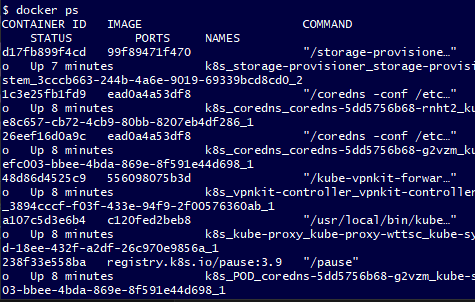

# What is Kubernetes (K8)

Allows you to create a group of containers that allows you to automatically scale, load balance and deploy among other functions. Essentially automates container management and simulates an ASG using containers.


### Why k8

K8 is used to build cloud microservice based apps. It's use of many containers at once with autoscaling functionality allows you to simulate an application if it was deployed on the cloud. Also, as it automates the creation of an ASG this has practical uses in actual app deployments as it allows you to automatically create an ASG for your application.

### Benefits of K8

- **Saves time**: As you're automating the creation of an ASG, you save time you would usually be spending creating it manually.
- **Open source**: This means K8 has a lot of community support and allows you to tweak K8 code for whatever purpose you need it for.
- **Multi-cloud compatible**: K8 allows you to deploy containers on multiple different cloud platforms, giving you flexibility for what cloud providers you want to use for what deployments, potentially saving you money as services vary in price between providers.
- **Enables easy scaling**: As K8 automates the creation of what is functionally similar to an ASG, it means K8 can be used to scale your applicaiton to meet demands.
- **Cheap**: K8 is cheaper than many of it's alternatives, and also provides the base software for free.

### K8 architecture


K8 works by essentially deploying 'pods' which contain copies of your contiainer.

### When not to use K8

K8 is designed for microservice based applications, and isn't appropriate for all cases. You shouldn't use K8 if...
- Your application is monolithic
- Your application is small enough that the components can be hosted on a couple of containers 
- You know you won't be recieving high amounts of traffic.

# How to use K8

Launch in the settings for Docker desktop.


This will create a massive list of containers, for autoscaling.



Next we need to make a kubenetes deployment in yaml. This points K8 to a Dockerhub image to deploy and generate what is functionally a ASG from it.

To do this we create the yaml and give it the specifications we need. In this case, we want 3 pods running our nginx image. We then use `kubectl create -f <name of yaml>` to run our replica set.

```
apiVersion: apps/v1
kind: Deployment
metadata:
  name: nginx-deployment # name of the deployment
spec:
  selector:
    matchLabels:
      app: nginx # looks for this label to make k8 service
  replicas: 3 # 3 pods
  template:
    metadata:
      labels:
        app: nginx # this label connects to the service/any other k8 components (name of pods)
    spec: # defining container specs
      containers:
      - name: nginx # name of container we'll give it
        image: joeburnsjb2/nginx:latest # name of image we're using to make containers in pods
        ports:
        - containerPort: 80 # what port will we open for our container?
```

When we get our pods we should see something like this, showing all of our pods are running copies of our nginx image. If one of these is taken down, it will be automatically relaunched while the other pods handle traffic.


However, we cannot connect to these pods by default, we need a service to be able to access them outside the network. Similar to an internet gateway.


To do this we create a new yaml file, and this time use the following. We also still use `kubectl create -f <name of yaml>` to run this service.

```
apiVersion: v1
kind: Service # defines this as a service
metadata:
  name: nginx-service
spec:
  selector:
    app: nginx # looks for this label to make k8 service
  ports:
  - name: nginx-port
    protocol: TCP
    port: 80 # what port on the pod do we want to access with nodePort?
    nodePort: 30080 # we need this in order to access our pod, we connect via port 30080 and this will display port 80 from our pod
  type: NodePort
```

When we get our services, we should see the following.


And we should be able to connect via port 30080.


# Useful commands

`kubectl get svc` will list all K8 services.

`kubectl get pods` will list all running pods.

`kubectl delete pod <NAME>` will delete the pod with associated name. Can also do same with `service` instead of `pod`.

`kubectl create -f <name of yaml>` runs based off specifications in yaml file.

`kubectl get rs` will list all replica sets.